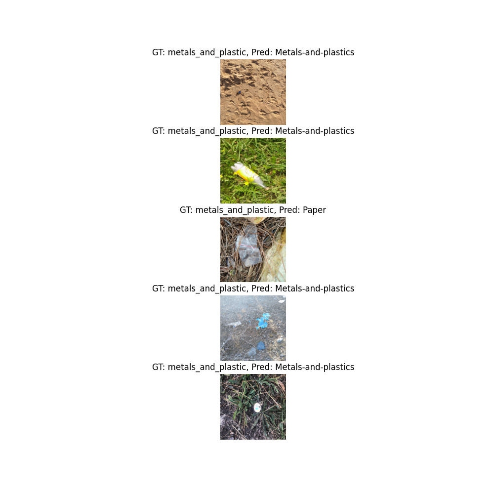
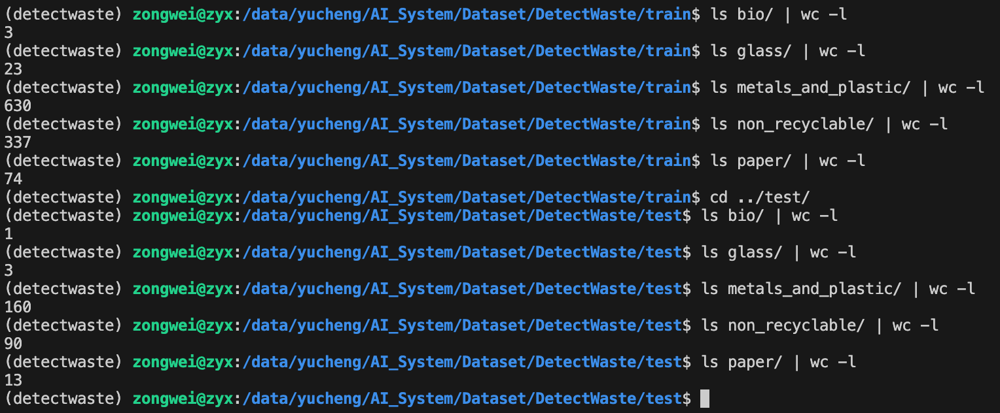

# Efficient-Net Classifier

## Introduction

Training code is from [detect-waste](https://github.com/wimlds-trojmiasto/detect-waste).

Usiing a imagenet pretrained EfficientNet-B2 model to classify waste images.

## Dataset

The dataset is from [TACO](https://github.com/pedropro/TACO) (1,500 images) and map to 5 classes (Bio, Glass, Metals-and-plastics, Non-recyclable, and Paper) using [dataset_converter.py](https://github.com/wimlds-trojmiasto/detect-waste/blob/main/utils/dataset_converter.py)

I also used default [pseudo labeling](https://github.com/wimlds-trojmiasto/detect-waste/blob/0a4367b121e4bfabdfb148b323090573ac2dadc2/classifier/models/efficientnet.py#L96) strategy in detectwaste to increase the dataset size since there are "unknown" class in TACO.

The images directory structure should be the following:
```
path/to/images/          # all images
    test/                # images divided into categories - test subset
        bio/
        glass/
        metals_and_plastic/
        non_recyclable/
        paper/
    train/                # images divided into categories - train subset
        bio/
        glass/
        metals_and_plastic/
        non_recyclable/
        paper/
```
You can find the image under `/data/yucheng/AI_System/Dataset/DetectWaste` directory.

## Installation

```bash
pip install -r requirements.txt
```

## Usage

```bash
python test_effnet.py
```

## Results

Epoch 19: loss=0.249, v_num=0, val_acc=0.577, val_acc_weighted=0.577, val_loss=1.42, train_acc=0.938, train_acc_weighted=0.938, train_loss=0.209, pseudo_loss=7.65]



## To-Do

- [ ] Unbalanced dataset.



